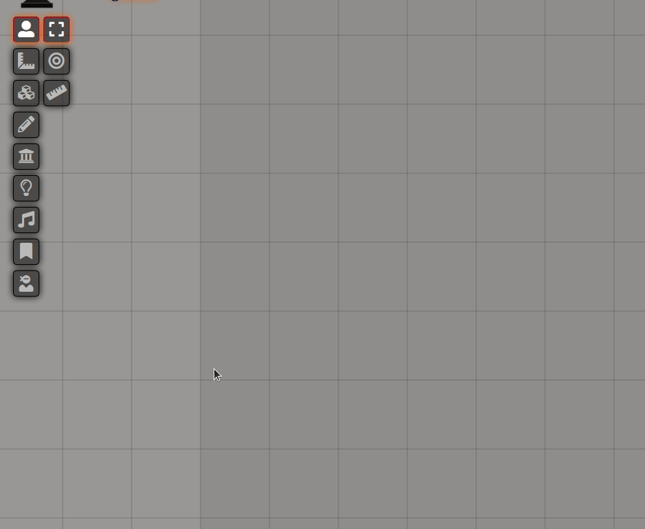

<!--- Downloads @ Latest Badge -->
<!--- replace <user>/<repo> with your username/repository -->
<!---  -->

<!--- Forge Bazaar Install % Badge -->
<!--- replace <your-module-name> with the `name` in your manifest -->
<!---  -->

# Table Ninja

Table Ninja makes looking up chosen tables swift and stealthy, so that you can maintain game flow while using them.

Maybe you have a whole bunch of tables for use in game that you never use because play gets too clunky when you do. Or maybe you would use tables for on-the-fly inspiration if there was a slicker way of doing so. If either of these are true, this module is for you.

## Installation

Go to Foundry setup, modules, and add new module:

https://raw.githubusercontent.com/Adriannom/fvtt-module-table-ninja/master/module.json

Then load your world, go to manage modules in the Game Settings tab and enable Table Ninja.

## Usage

You have to supply your own tables. One good source of tables is the "Foundry Community Tables" module. When you have some, put them in the "Table Ninja" folder, and click on the new ninja icon in scene controls. If your tables aren't there, hit refresh.

You can use subfolders too:

## Credits

Created by Adriannom.

Thanks to bmarian, Calego, errational, Mougli, Rughalt.
If I've missed you, poke me.