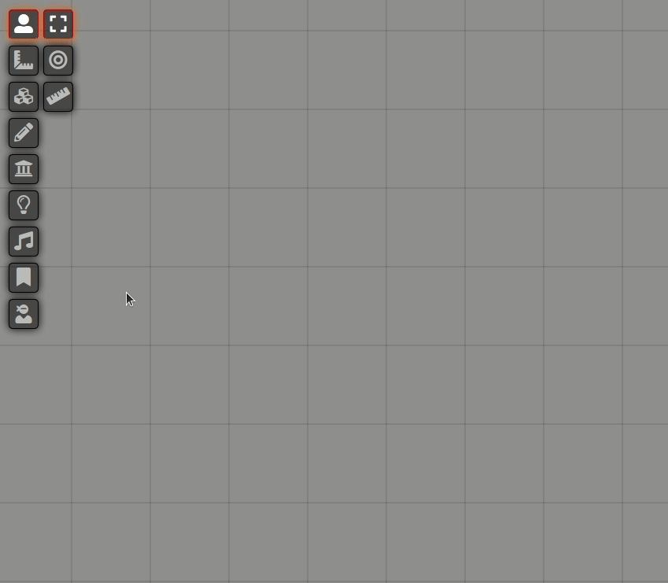
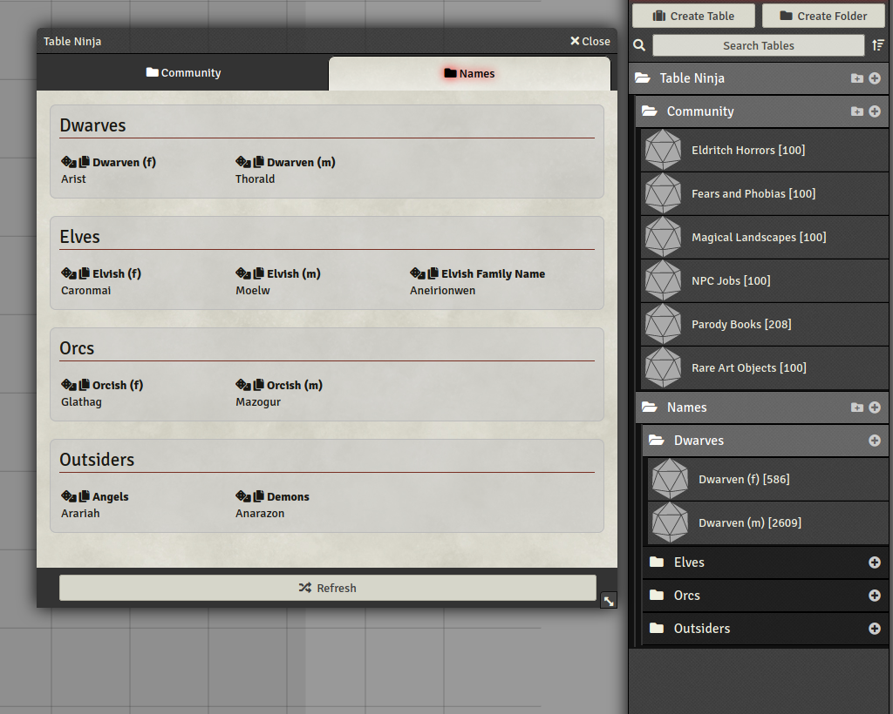

<!--- Downloads @ Latest Badge -->
<!--- replace <user>/<repo> with your username/repository -->
<!---  -->

<!--- Forge Bazaar Install % Badge -->
<!--- replace <your-module-name> with the `name` in your manifest -->
<!---  -->

# Table Ninja

Table Ninja makes looking up chosen tables swift and stealthy, so that you can maintain game flow while using them.

Maybe you have a whole bunch of tables for use in game that you never use because play gets too clunky when you do. Or maybe you would use tables for on-the-fly inspiration if there was a slicker way of doing so. If either of these are true, this module is for you.

It works like this:

1. At the click of a button it shows a random result from each table all in the same window.
2. If you're not happy with a result, you can reroll that table or all the tables at once.
3. If you need to quickly vet results, instead of rerolling you can peruse a big random selection of results from a table.
4. You can click the copy button to easily copy a result for use elsewhere.

## Installation

Go to Foundry setup, modules, and add new module:

https://raw.githubusercontent.com/Adriannom/fvtt-module-table-ninja/master/module.json

Then load your world, go to manage modules in the Game Settings tab and enable Table Ninja.

## Usage

You currently have to supply your own tables. One good source of tables is the "Foundry Community Tables" module.

Create Subfolders within the Table Ninja folder under the "Rollable Tables" tab on the right. Each folder counts as a tab, inside which you can have tables and groups of tables (created by making further subfolders). For example:

When you have some tables in the right place, click on the new ninja icon in the scene controls on the left.

## Credits

Created by Adriannom.

Thanks to bmarian, Calego, errational, Mougli, Rughalt.
If I've missed you, poke me.